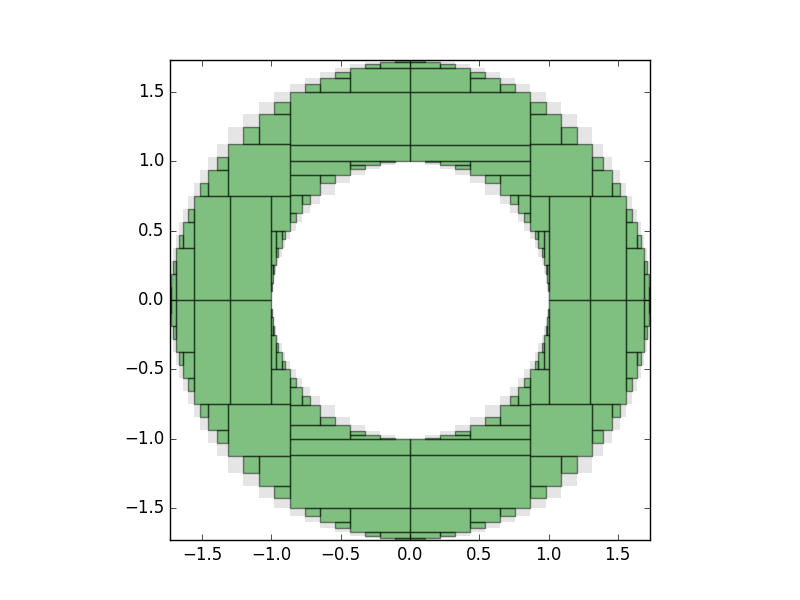

# `IntervalConstraintProgramming.jl`

This Julia package allows you to specify a set of **constraints** on real-valued variables, given by (in)equalities, and
rigorously calculate inner and outer approximations to the *feasible set*,
i.e. the set that satisfies the constraints.

This uses interval arithmetic provided by the author's
[`IntervalArithmetic.jl`](https://github.com/dpsanders/IntervalArithmetic.jl) package,
in particular multi-dimensional `IntervalBox`es, i.e. Cartesian products of one-dimensional intervals.

To do this, *interval constraint programming* is used, in particular the
so-called "forward--backward contractor". This is implemented in terms of *separators*; see
[Jaulin & Desrochers].

```@meta
DocTestSetup = quote
    using IntervalConstraintProgramming, IntervalArithmetic
end
```

## Usage
Let's define a constraint, using the `@constraint` macro:
```jldoctest
julia> using IntervalConstraintProgramming, IntervalArithmetic

julia> S = @constraint x^2 + y^2 <= 1
Separator:
- variables: x, y
- expression: x ^ 2 + y ^ 2 ∈ [-∞, 1]
```
It works out automatically that `x` and `y` are variables.
The macro creates a `Separator` object, in this case a `ConstraintSeparator`.

We now create an initial interval box in the $x$--$y$ plane:
```julia
julia> x = y = -100..100   # notation for creating an interval with `IntervalArithmetic.jl`

julia> X = IntervalBox(x, y)
```

The `@constraint` macro defines an object `S`, of type `Separator`.
This is a function which,
when applied to the box $X = x \times y$
in the x--y plane, applies two *contractors*, an inner one and an outer one.

The inner contractor tries to shrink down, or *contract*, the box, to the smallest subbox
of $X$ that contains the part of $X$ that satisfies the constraint; the
outer contractor tries to contract $X$ to the smallest subbox that contains the
region where the constraint is not satisfied.

When `S` is applied to the box `X`, it returns the result of the inner and outer contractors:
```julia
julia> inner, outer = S(X);

julia> inner
([-1, 1],[-1, 1])

julia> outer
([-100, 100],[-100, 100])
```

## Set inversion: finding the feasible set

To make progress, we must recursively bisect and apply the contractors, keeping
track of the region proved to be inside the feasible set, and the region that is
on the boundary ("both inside and outside"). This is done by the `pave` function,
that takes a separator, a domain to search inside, and an optional tolerance:

```julia
julia> using Plots

julia> x = y = -100..100

julia> S = @constraint 1 <= x^2 + y^2 <= 3

julia> paving = pave(S, X, 0.125);
```

`pave` returns an object of type `Paving`. This contains: the separator itself;
an `inner` approximation, of type `SubPaving`, which is an alias for a `Vector` of `IntervalBox`es;
a `SubPaving` representing the boxes on the boundary that could not be assigned either to the inside or outside of the set;
and the tolerance.

We may draw the result using a plot recipe from `IntervalArithmetic`. Either a
single `IntervalBox`, or a `Vector` of `IntervalBox`es (which a `SubPaving` is)
maybe be drawn using `plot` from `Plots.jl`:
```julia
julia> plot(paving.inner, c="green")
julia> plot!(paving.boundary, c="gray")
```

The output should look something like this:




The green boxes have been **rigorously** proved to be contained within the feasible set,
and the white boxes to be outside the set. The grey boxes show those that lie on the boundary, whose status is unknown.

### 3D

The package works in any number of dimensions, although it suffers from the usual exponential slowdown in higher dimensions ("combinatorial explosion"); in 3D, it is still relatively fast.

There are sample 3D calculations in the `examples` directory, in particular in the [solid torus notebook](examples/Solid torus.ipynb), which uses [`GLVisualize.gl`](https://github.com/JuliaGL/GLVisualize.jl) to provide an interactive visualization that may be rotated and zoomed. The output for the solid torus looks like this:


## Set operations
Separators may be combined using the operators `!` (complement), `∩` and `∪` to make
more complicated sets; see the [notebook](https://github.com/JuliaIntervals/IntervalConstraintProgrammingNotebooks/blob/master/Basic%20examples%20of%20separators.ipynb) for several examples. Further examples can be found in the repository [IntervalConstraintProgrammingNotebooks](https://github.com/JuliaIntervals/IntervalConstraintProgrammingNotebooks).

## Author

- [David P. Sanders](http://sistemas.fciencias.unam.mx/~dsanders)
    - [Julia lab, MIT](http://julia.mit.edu/)
    - Departamento de Física, Facultad de Ciencias, Universidad Nacional Autónoma de México (UNAM)


## References:
- *Applied Interval Analysis*, Luc Jaulin, Michel Kieffer, Olivier Didrit, Eric Walter (2001)
- Introduction to the Algebra of Separators with Application to Path Planning, Luc Jaulin and Benoît Desrochers, *Engineering Applications of Artificial Intelligence* **33**, 141–147 (2014)

## Acknowledements
Financial support is acknowledged from DGAPA-UNAM PAPIME grants PE-105911 and PE-107114, and DGAPA-UNAM PAPIIT grant IN-117214, and from a CONACYT-Mexico sabbatical fellowship. The author thanks Alan Edelman and the Julia group for hospitality during his sabbatical visit. He also thanks Luc Jaulin and Jordan Ninin for the [IAMOOC](http://iamooc.ensta-bretagne.fr/) online course, which introduced him to this subject.
